# 簡單git基本操作

作者: CHUN-CHENG LIN
日期: 2025/01/16

## 下載git

下載完git後，請到terminal檢查是否已經裝好

```sh
git --version
```

如果看到類似以下畫面基本ok了
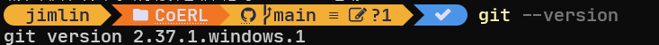

若沒有可以下載

```sh
sudo apt install git
```

## Branch很重要

### 什麼是branch

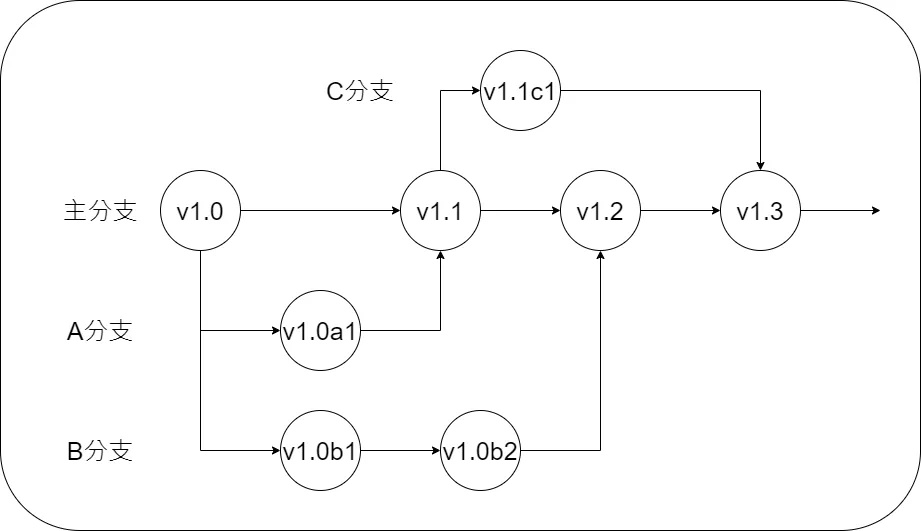
圖片來源: [【Git】分支的基本操作與概念](https://medium.com/@kenken880929/git-branch-basic-6f10f826434d)
如上面的示意圖，主分支(main)是最重要的，但開發功能時不建議在主分支上，在些新功能時可以開心的branch，如上圖的A、B、C branch，分支可以中途開，寫完功能後再merge回主分支。
好處是可以減少與其他人一起撰寫時可能互相影響的發生。

### 確認現在處於哪個branch

```sh
git branch
```


如上圖代表你現在處於main branch

```sh
git switch <branch名稱>
```

### 創建新branch

```sh
git switch -c <branch名稱>
```

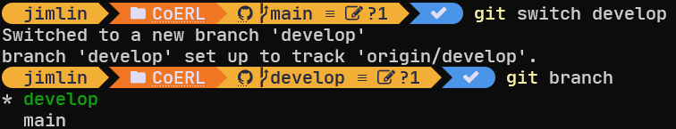

## 上傳到github

> 在你電腦上的是只有你電腦的版本，需要push到github上

最基本的github使用流程就是:
> add $\to$ commit $\to$ pull(若需要) $\to$ push

### add

**add**用於將你電腦上的檔案的所有改動暫存到暫存區，還沒傳到github上。

```sh
git add <檔案、路徑、資料夾>
```

一個不建議但最方便的操作(慎用)

```sh
git add .
```

會將所有在此git專案目錄底下的檔案都交上去，但可能會傳到你不想要的上傳的檔案。

### commit

**commit**用於將暫存區的改動提交到本地儲存庫，紀錄一個新版本，但還沒傳到github上。

```sh
git commit -m "<版本描述，可以寫改了什麼，要字串符>"
```

使用後會將之前add到暫存區的搬到本地儲存庫。

### push

**push**將本地儲存庫的提交推送到遠端儲存庫 (Remote Repository)，也就是github。

```sh
# 推送到遠端的分支(第一次傳時)
git push origin <branch名稱>
# 如果已經設置默認分支，可直接推送(非第一次傳)   
git push         
```

### 上傳範例

原本github上的檔案:
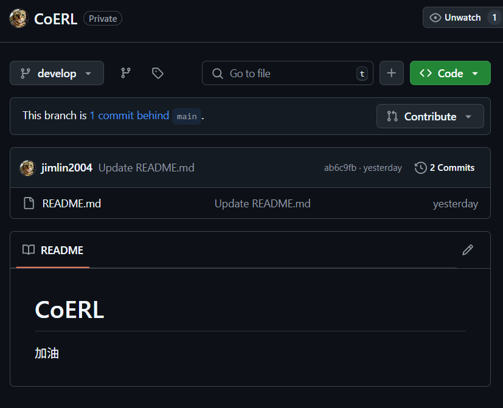
希望將README.md改成
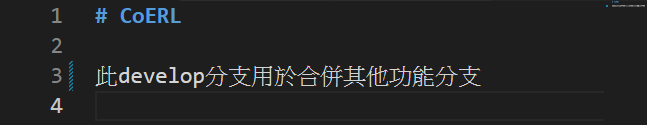
修改完檔案後準備上傳到github上
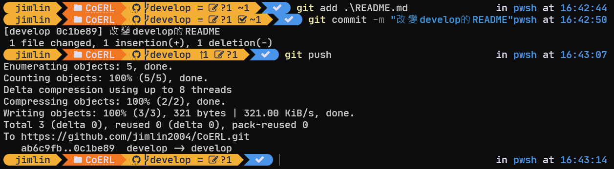
上傳成功就可以看到github上已經被改變了
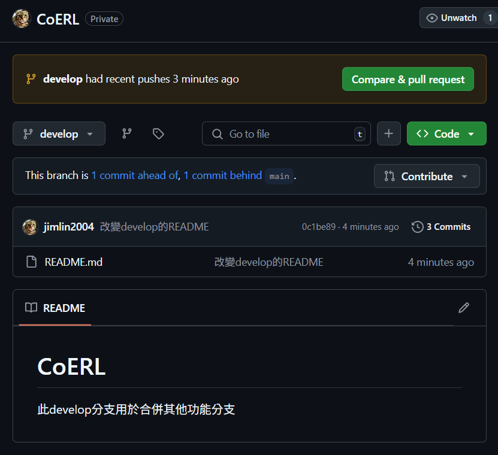

### pull

如果你電腦上的版本落後於github上的版本(如其它人先上傳了)，我們會需要先將github上的版本載下來，除非電腦的版本是與github一樣的最新版本，否則**push**都會**發生錯誤**。

```sh
git pull
```

可以將github上的版本拉下來到本地儲存庫，但直接pull可能會發生自己修改的檔案被覆蓋掉，因此我們需要先將自己的修改commit到本地儲存庫，這樣就不用擔心被直接覆蓋，但遇到衝突問題還是要人工解決。

#### 衝突範例

今天想要將README再添加綠色那一行
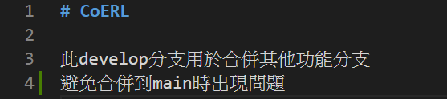
但是有個人(組員A)先上傳了他的版本到github上
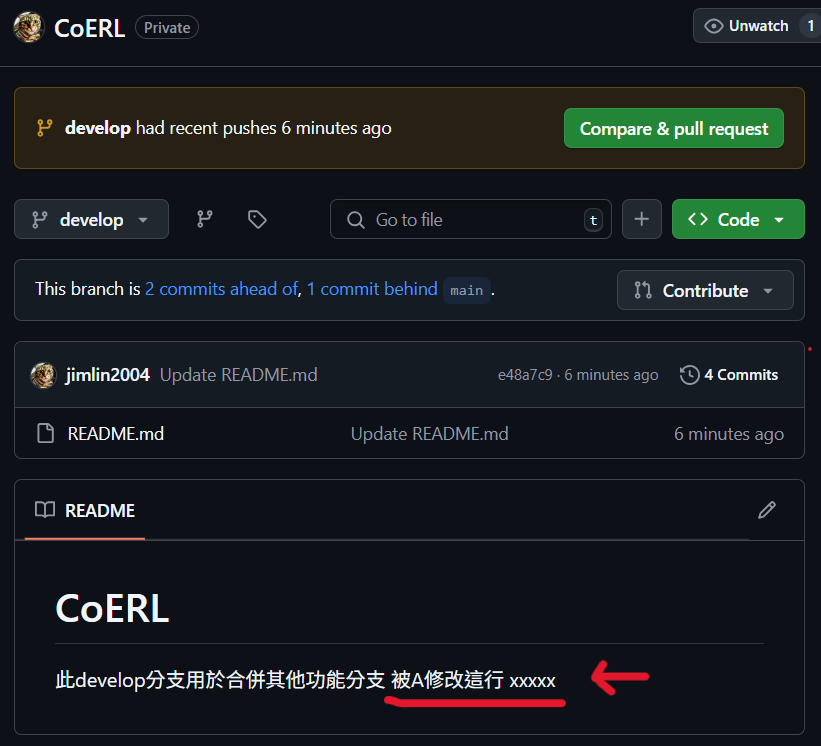
此時直接上傳會遇到error
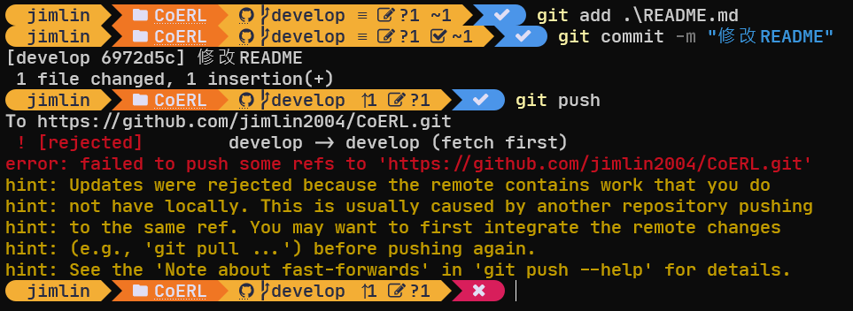
我們試著pull
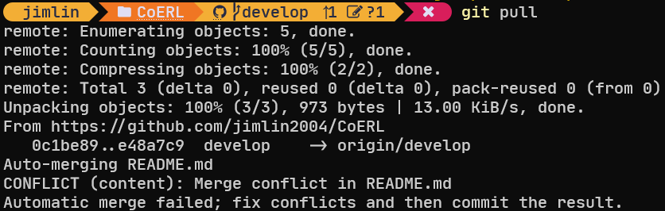
發生了自動合併錯誤，git只能處理簡單的自動合併，更多需要開發者解決。
可以用git status看衝突發生在哪裡

```sh
git status
```

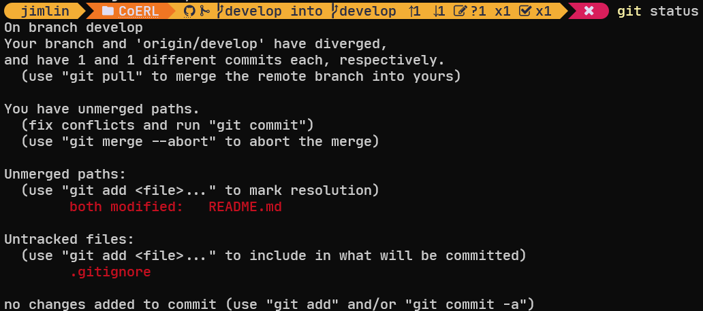
可以看到是README.md被兩邊修改過。
現在能做的是有:

1. 遇到問題，解決有問題的人
2. 問題被提出，解決提出問題的人
3. 兩邊溝通後，決定如何修改或保留一邊

可以在vscode中看到(如果有裝git相關插件)
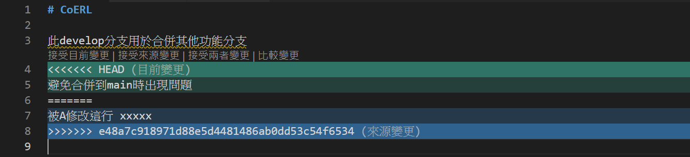
經過好的溝通後，決定保留你的版本，此時要將README.md中的衝突標記修掉
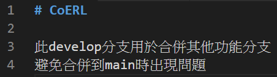
之後只要再上傳一次衝突的檔案即可，問題解決
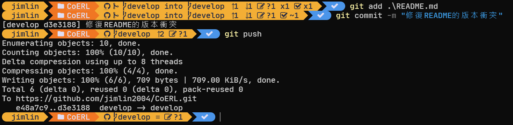
可以看到github上的版本已經是你的版本了
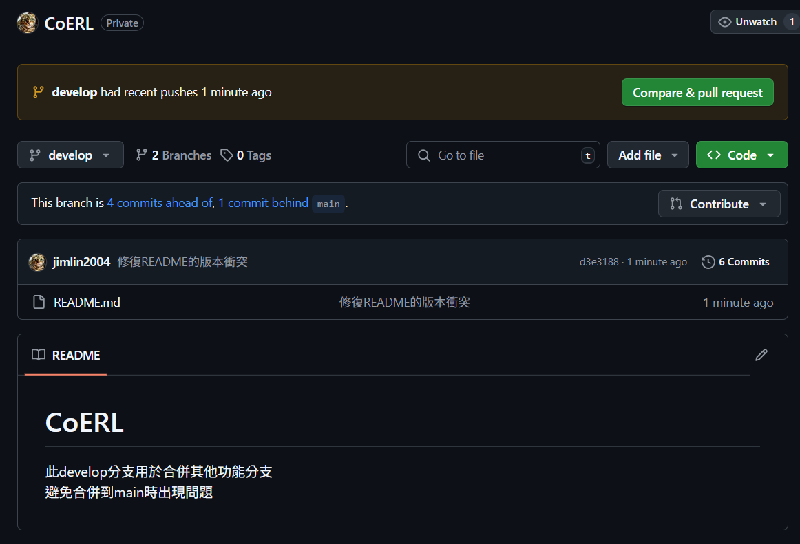

## 補充

### .gitignore

這是特別的檔案名稱，只有取名為 **.gitignore** 才有效果，如果有不想放到github上或被git追蹤版本的檔案(如後端的.env、密碼等)，只要在.gitignore中寫上檔案或資料夾的路徑，就不會被傳到github上
如下圖的範例，這些路徑的檔案、資料夾就不會被git追蹤版本:
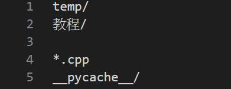
裡面的路徑是相對於.gitignore的相對路徑，一個專案可以有很多個.gitignore在不同的路徑下一起使用。
在vscode中可以看到加入.gitignore的路徑會是灰色的:
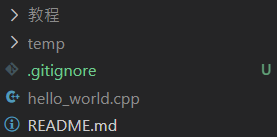
另外.gitignore可以上傳也可以不傳到github上，只在本地儲存庫一樣有效，但github那邊就不受到約束，因此其它組員可能會不小心傳到不想要的檔案。
