# 簡單git基本操作

作者: CHUN-CHENG LIN
日期: 2025/01/16

## 下載git

下載完git後，請到terminal檢查是否已經裝好

```sh
git --version
```

如果看到類似以下畫面基本ok了


若沒有可以下載

```sh
sudo apt install git
```

## Branch很重要

### 什麼是branch


圖片來源: [【Git】分支的基本操作與概念](https://medium.com/@kenken880929/git-branch-basic-6f10f826434d)
如上面的示意圖，主分支(main)是最重要的，但開發功能時不建議在主分支上，在些新功能時可以開新的branch，如上圖的A、B、C branch，分支可以中途開，寫完功能後再merge回主分支。
好處是可以減少與其他人一起撰寫時可能互相影響的發生。

### 確認現在處於哪個branch

```sh
git branch
```


如上圖代表你現在處於main branch

```sh
git switch <branch名稱>
```

### 創建新branch

```sh
git switch -c <branch名稱>
```


## 上傳到github

> 在你電腦上的是只有你電腦的版本，需要push到github上

最基本的github使用流程就是:
> add $\to$ commit $\to$ pull(若需要) $\to$ push

### add

**add**用於將你電腦上的檔案的所有改動暫存到暫存區，還沒傳到github上。

```sh
git add <檔案、路徑、資料夾>
```

一個不建議但最方便的操作(慎用)

```sh
git add .
```

會將所有在此git專案目錄底下的檔案都交上去，但可能會傳到你不想要的上傳的檔案。

### commit

**commit**用於將暫存區的改動提交到本地儲存庫，紀錄一個新版本，但還沒傳到github上。

```sh
git commit -m "<版本描述，可以寫改了什麼，要字串符>"
```

使用後會將之前add到暫存區的搬到本地儲存庫。

### push

**push**將本地儲存庫的提交推送到遠端儲存庫 (Remote Repository)，也就是github。

```sh
# 推送到遠端的分支(第一次傳時)
git push origin <branch名稱>
# 如果已經設置默認分支，可直接推送(非第一次傳)   
git push         
```

### 上傳範例

原本github上的檔案:

希望將README.md改成

修改完檔案後準備上傳到github上

上傳成功就可以看到github上已經被改變了


### pull

如果你電腦上的版本落後於github上的版本(如其它人先上傳了)，我們會需要先將github上的版本載下來，除非電腦的版本是與github一樣的最新版本，否則**push**都會**發生錯誤**。

```sh
git pull
```

可以將github上的版本拉下來到本地儲存庫，但直接pull可能會發生自己修改的檔案被覆蓋掉，因此我們需要先將自己的修改commit到本地儲存庫，這樣就不用擔心被直接覆蓋，但遇到衝突問題還是要人工解決。

#### 衝突範例

今天想要將README再添加綠色那一行

但是有個人(組員A)先上傳了他的版本到github上

此時直接上傳會遇到error

我們試著pull

發生了自動合併錯誤，git只能處理簡單的自動合併，更多需要開發者解決。
可以用git status看衝突發生在哪裡

```sh
git status
```


可以看到是README.md被兩邊修改過。
現在能做的是有:

1. 遇到問題，解決有問題的人
2. 問題被提出，解決提出問題的人
3. 兩邊溝通後，決定如何修改或保留一邊

可以在vscode中看到(如果有裝git相關插件)

經過好的溝通後，決定保留你的版本，此時要將README.md中的衝突標記修掉

之後只要再上傳一次衝突的檔案即可，問題解決

可以看到github上的版本已經是你的版本了


## 版本控制

### 查看歷史

```sh
# 查看詳細提交歷史
git log
# 簡單顯示提交歷史
git log --oneline
```

詳細歷史:
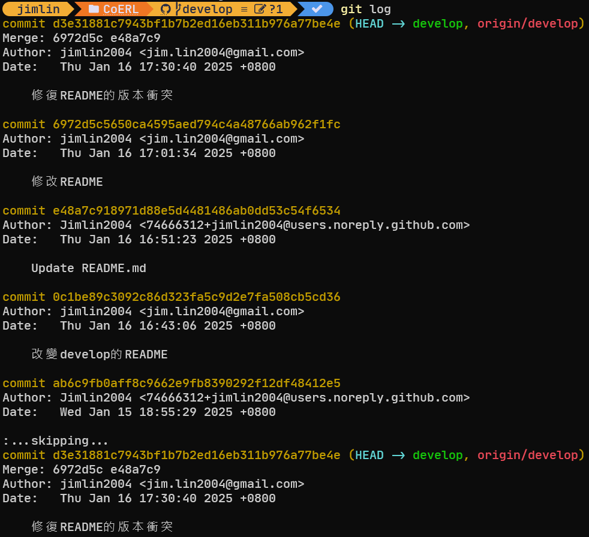
簡單顯示歷史
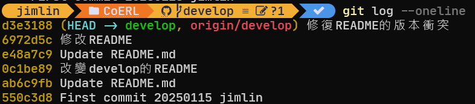

### 回滾版本

#### reset

> 使用前請想好，reset不保留git記錄的歷史。

```sh
# 指定commit-hash(也就是絕對的概念)
git reset --soft <commit-hash>
# 退回指定版本的前n個版本(相對的概念)
git reset --soft <commit-hash>~n
# 退回現在的前n個版本(相對的概念)
git reset --soft HEAD~n
```

只退回commit，電腦程式碼與暫存區不會受到影響。

```sh
# 指定commit-hash(也就是絕對的概念)
git reset --hard <commit-hash>
# 退回指定版本的前n個版本(相對的概念)
git reset --mixed <commit-hash>~n
# 退回現在的前n個版本(相對的概念)
git reset --mixed HEAD~n
```

**--mixed** 是預設的，退回commit以及暫存區，電腦程式碼不受影響。

```sh
# 指定commit-hash(也就是絕對的概念)
git reset --hard <commit-hash>
# 退回指定版本的前n個版本(相對的概念)
git reset --hard <commit-hash>~n
# 退回現在的前n個版本(相對的概念)
git reset --hard HEAD~n
```

**--hard** 使用前請想清楚，會退回所有的commit、暫存區以及電腦裡的程式碼。

#### revert

> revert的本質是還原commit

```sh
git revert <commit-hash>
git revert <commit-hash>~n
git revert HEAD~n
# 一次撤銷多個版本
git revert <oldest-commit-hash>..<newest-commit-hash>
# "-n"代表不要"自動"將revert的commit提交出去
git revert -n <commit-hash>
# --no-edit代表跳過提交訊息的編輯過程，直接使用默認的撤銷訊息(後面demo解釋)
git revert --no-edit <commit-hash>
```

revert真正做的事情是創一個新的commit去撤銷(還原)一個過去版本的commit，以達到回滾版本的效果。
revert與reset最大的不同是revert不會刪除commit history，在git的紀錄裡相對完整，適用於多人合作中使用。

#### 回滾版本範例

假設原本已經新增一個demo.py到git中
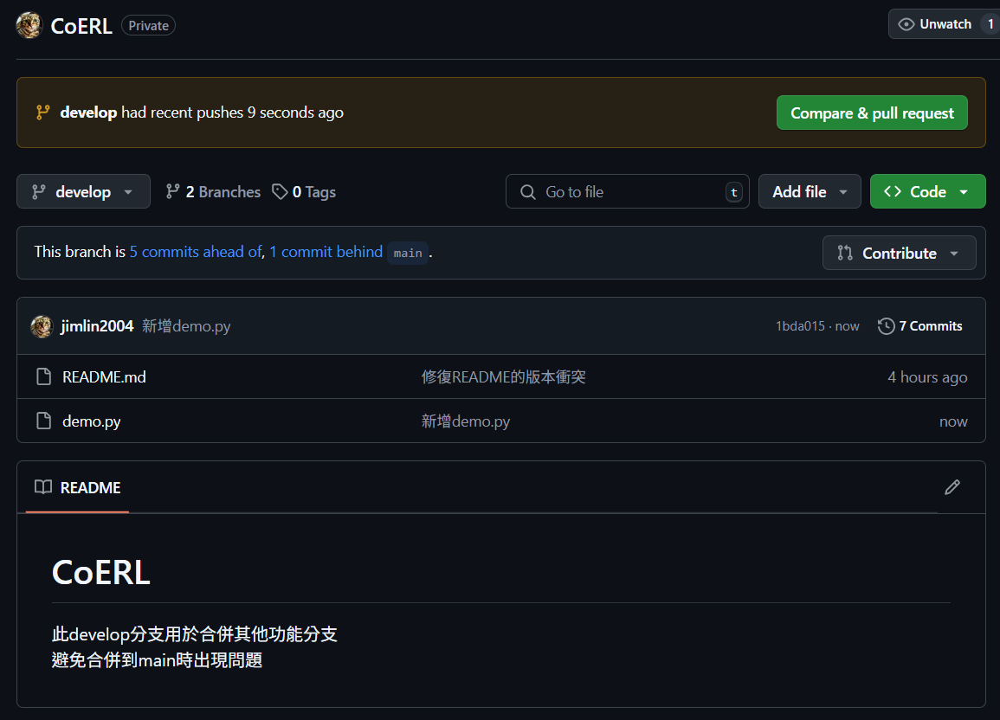
我不想要demo.py了，我可以用git log --oneline查看
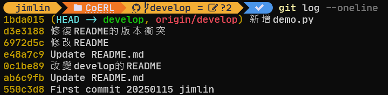
不要1bda015這個commit，所以刪除他
這裡用revert作範例:
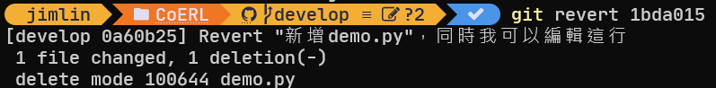
打完指令會跳到編輯器(我的電腦自動打開vim了)
黃色箭頭那裡可以寫commit的字
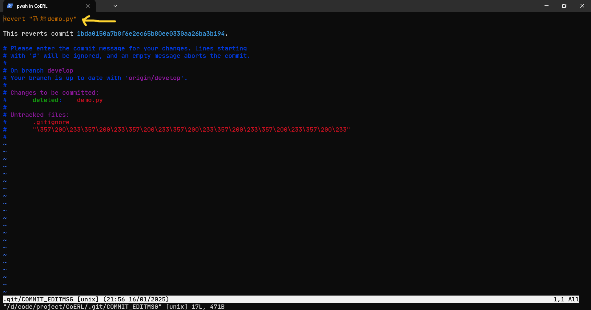
在github中可以看到紀錄
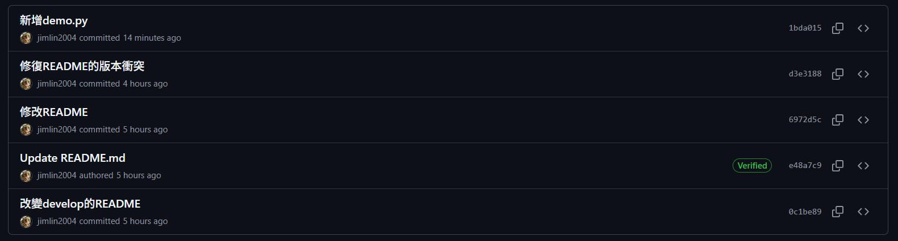
revert後記得push上去
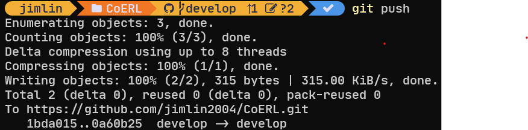
再看到github中，提交歷史都在，還多了一個
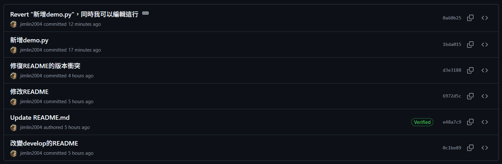
但是要退回的demo.py確實不見了
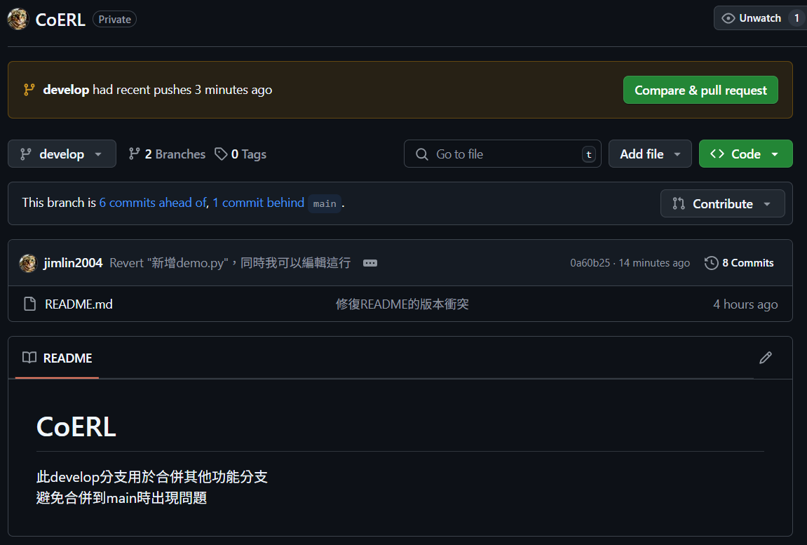
再來可以嘗試reset
這裡用退回最多的reset --hard
要退回到新增demo.py之前
版本是d3e3188，所以

一樣要push上去，否則只有自己這邊會改動
因為reset算是破壞性的操作，會產生衝突，
所以只能強制傳上去
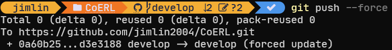
可以發現到github裡的紀錄變回
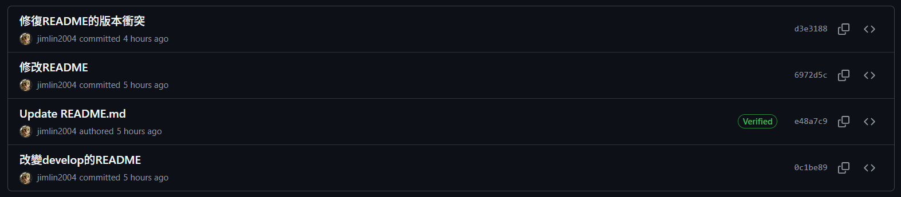
之前的commit紀錄都會消失，同時也可以發現自己的電腦裡的demo.py也被刪除了，所以慎用reset。

## 補充

### .gitignore

這是特別的檔案名稱，只有取名為 **.gitignore** 才有效果，如果有不想放到github上或被git追蹤版本的檔案(如後端的.env、密碼等)，只要在.gitignore中寫上檔案或資料夾的路徑，就不會被傳到github上
如下圖的範例，這些路徑的檔案、資料夾就不會被git追蹤版本:

裡面的路徑是相對於.gitignore的相對路徑，一個專案可以有很多個.gitignore在不同的路徑下一起使用。
在vscode中可以看到加入.gitignore的路徑會是灰色的:

另外.gitignore可以上傳也可以不傳到github上，只在本地儲存庫一樣有效，但github那邊就不受到約束，因此其它組員可能會不小心傳到不想要的檔案。
