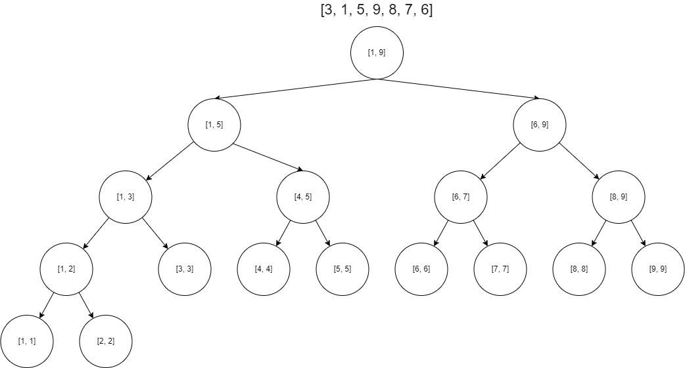
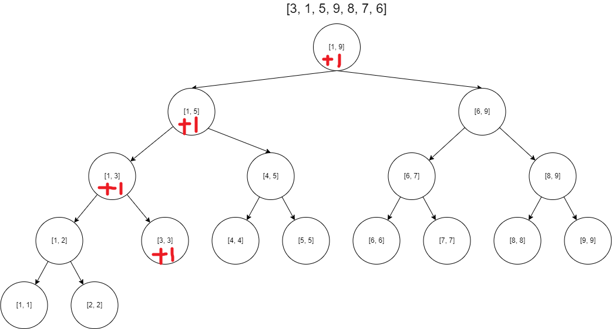
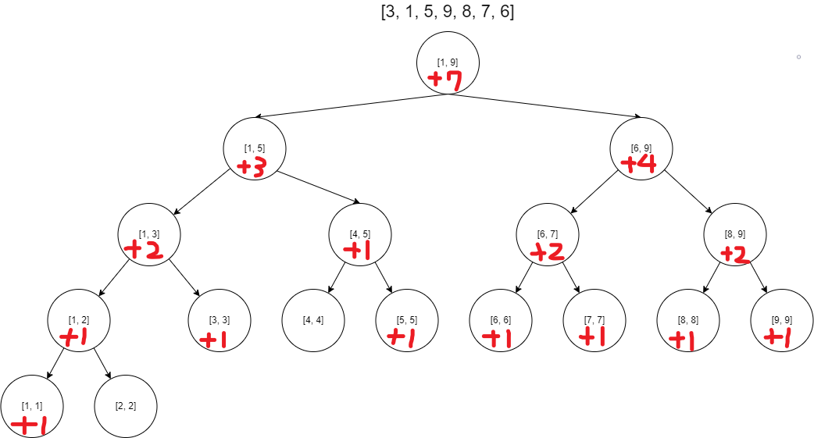
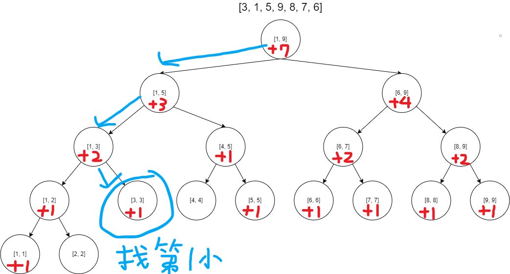

# 值域線段樹

---

## 用途: 求區間第$k-th$小(大)

## 問題

> 原陣列: [3, 1, 5, 9, 8, 7, 6]
> 要求第3小的值

## 解題

> 值域線段是統計陣列中元素的數量的線段樹。

線段樹的初始

加入3後

類似於用線段樹去維護Bucket sort
以此類推
會得到


> 找第2小的值



+ **step 1.** Node[1, 9]中告訴我們有7個數值，由於我們是值域作為線段樹的範圍，在此線段樹的範圍是[1, m] (m是值域的最大值，在此等於9)，可以很直觀的觀察到Node[1, 9]左子樹的值域都比右子樹的值域小，整個線段樹有個單調性質，使我們有一種類似二分搜的思維，在Node[1, 9]時我們訪問左子樹告訴我們[1, 5]有3個元素，右子樹有4個元素，我們要求的是第2小的元素，理所當然我們要去左子樹，因為左子樹有[1, 9]區間中最小的前3個元素。
+ **step 2.** Node[1, 5]的左子樹有2個元素，右子樹有1個元素，要找第2小，所以往左子樹前進。
+ **step 3.** Node[1, 3]的左子樹有1個元素，右子樹有1個元素，代表說左子樹[1, 2]中有區間第1小的元素，我們前往右子樹。
+ **step 4.** 到了Node[3, 3]，我們是要找第2小的元素嗎?當然不是，由於上一個節點我們知道左子樹有1個比當前區間小的元素，所以在Node[3, 3]中要找的變為第(2 - 1)小的元素，且到了線段樹的葉節點，我們得到了一開始[1, 9]的第2小元素為3。

透過這種方法，我們可以在$O(log(n))$的時間找到第$k-th$小的元素

## 改進

剛剛的討論，我們可以簡單寫出值域線段樹的單點修改與單點查詢，但是由於這種方法的線段樹範圍是[1, m] (m是值域最大值)，如果我們遇到題目說原陣列的數值範圍是$1 \le m \le 1e9$，原陣列.length $1 \le n \le 30000$，難道要開int[1e9 * 4]的空間給值域線段樹?

方法不切實際，有兩種方式可以解決

### 第一種: 離散化

這種方法便是把原陣列[1 ~ m]映射到[1 ~ n]，用兩個陣列可達成:

```cpp
#define maxn 30005

//原陣列
int nums[maxn];
//離散化映射用
int id[maxn];

int main()
{
    int m, n;
    cin >> m >> n;
    //讀入資料到nums ...

    for (int i = 1; i <= m; ++i)
    {
        cin >> nums[i];
        id[i] = nums[i];
    }

    //離散化
    //防止m == 0
    if (m)
        sort(id + 1, id + m + 1);
    //將重複的值去掉，類似於python的set
    int stSize = unique(id + 1, id + m + 1) - (id + 1);
    for (int i = 1; i <= m; ++i)
    {
        nums[i] = lower_bound(id + 1, id + stSize + 1, nums[i]) - id;
    }
}
```

這種方法有個限制，**只能離線**。

### 第二種: 動態開點

改用指標型線段樹，只是會多不少程式。

## 例題

### UVA 501

[https://onlinejudge.org/external/5/501.pdf](https://onlinejudge.org/external/5/501.pdf)

基本上就是單點修改與單點查詢

AC code 0.060s

```cpp
#include <iostream>
#include <cstring>
#include <algorithm>
using namespace std;

//權值線段樹 + 離散化 解決區間第k小問題

//其他網路上的解法: 2個heap，Treap，AVL tree

#define maxn 30005

int nums[maxn];
int getArr[maxn];
int id[maxn];

int st[maxn << 2];

void update(int index, int l, int r, int qx)
{
    if (l == r)
    {
        ++st[index];
        return;
    }

    int mid = (l + r) / 2;
    if (qx <= mid)
        update(index * 2, l, mid, qx);
    else
        update(index * 2 + 1, mid + 1, r, qx);
    st[index] = st[index * 2] + st[index * 2 + 1];
}

//找區間第k個小的
int query(int index, int l, int r, int k)
{
    if (l == r)
        return id[l];
    int mid = (l + r) / 2;
    //k比左子樹小
    if (k <= st[index * 2])
        return query(index * 2, l, mid, k);
    else
        return query(index * 2 + 1, mid + 1, r, k - st[index * 2]);
}

int main()
{
    int t;
    cin >> t;
    bool first = true;
    while (t--)
    {
        if (first)
            first = false;
        else
            puts("");
        memset(st, 0, sizeof(st));
        int m, n;
        cin >> m >> n;
        for (int i = 1; i <= m; ++i)
        {
            cin >> nums[i];
            id[i] = nums[i];
        }

        for (int i = 0; i < n; ++i)
            cin >> getArr[i];

        //離散化
        //防止m == 0
        if (m)
            sort(id + 1, id + m + 1);
        int stSize = unique(id + 1, id + m + 1) - (id + 1);
        for (int i = 1; i <= m; ++i)
        {
            nums[i] = lower_bound(id + 1, id + stSize + 1, nums[i]) - id;
        }
        
        int addCount = 0;
        int getCount = 0;
        int k = 1;
        while (getCount < n)
        {
            if (getArr[getCount] == addCount)
            {
                printf("%d\n", query(1, 1, stSize, k));
                ++k;
                ++getCount;
            }
            else
            {
                update(1, 1, stSize, nums[addCount + 1]);
                ++addCount;
            }
        }

        
    }
    return 0;
}
```
